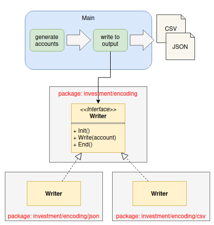

# Investment account generator

This is to generate investment account with random holding units for the following tickers:
"AAPL", "SBUX", "MSFT", "CSCO", "QCOM", "META", "AMZN", "TSLA", "AMD", "NFLX"

This tool is designed to generate a huge volume of testing account with concurrency in either CSV or JSON file format

Adjust the constants in generator/main.go for the testing account volume and output encoding CSV / JSON
```
const (
	AccountPrefix  = "INV"
	BatchCount     = 2
	BatchSize      = 10
	OutputPath     = "./output"
	MaxHoldingUnit = 100
	Encoding       = "CSV"
)
```

## Design
The design abstracts away the encoding implementation from the main program:
